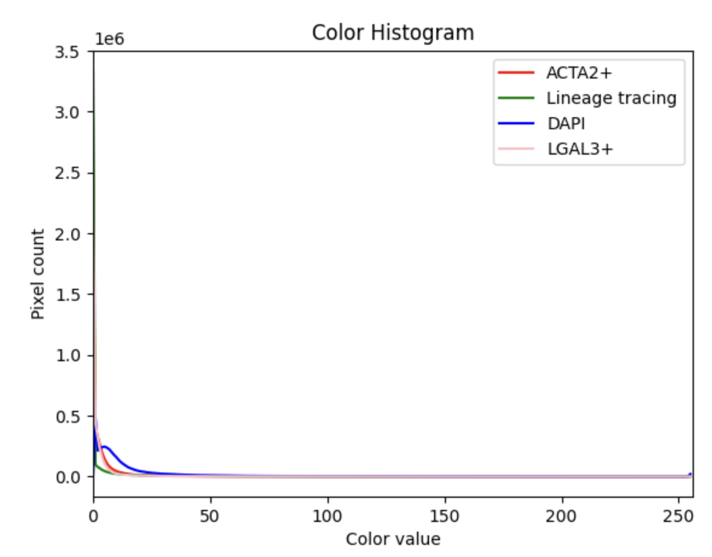

This repository is used to convert multi-channel fluorescent images into RGB images.

The RGB format of multi-channel fluorescent images with nuclei and Lineage Tracing marker:

The pixel distribution per channel:

